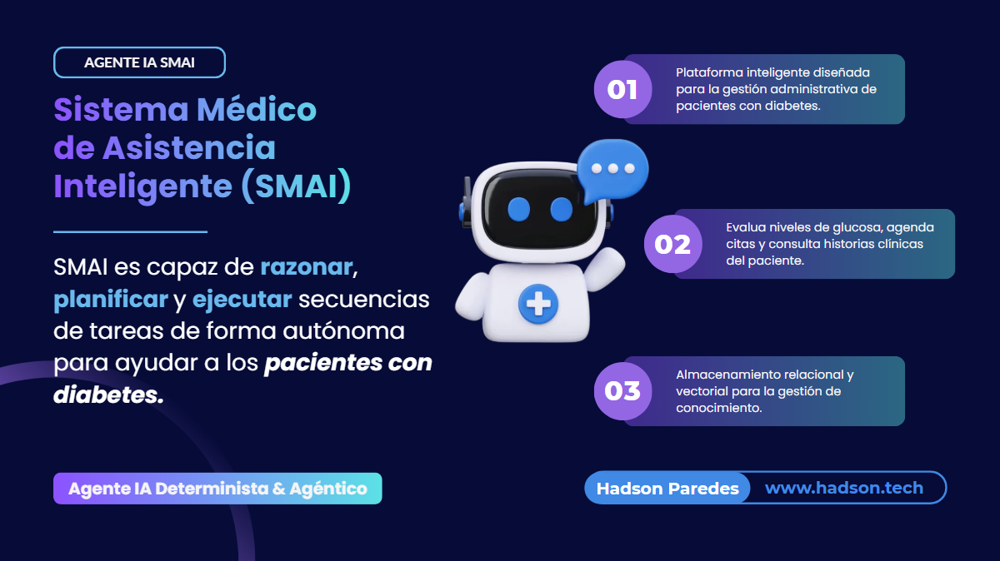
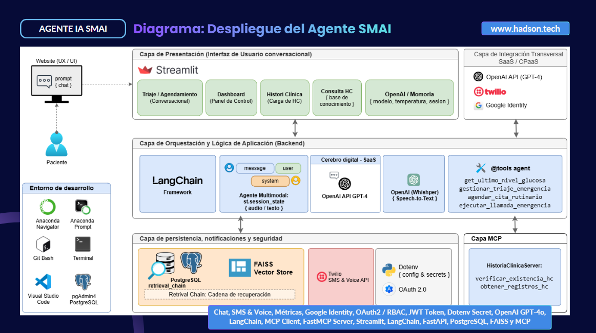
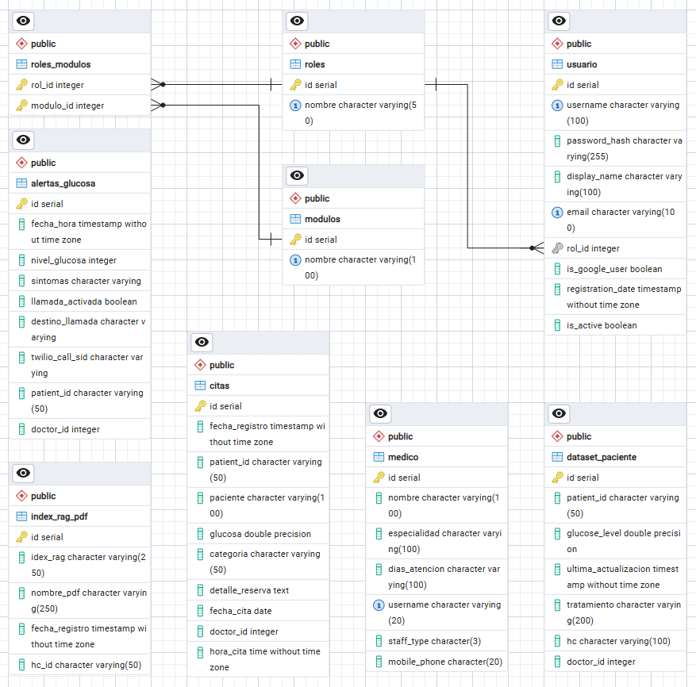

# Proyecto Agéntico LMPE2355-20260825

Denominado como **Sistema Médico de Asistencia Inteligente (SMAI)** desarrollada aplicando inteligencia artificial, **SMAI** es capaz de razonar, planificar y ejecutar secuencias de tareas de forma autónoma para ayudar a los pacientes con diabetes. El sistema combina un enfoque **Determinista** (para reglas clínicas estrictas y validaciones) con un enfoque **Agéntico - ReAct** (razonamiento inductivo y selección dinámica de herramientas).



## Documento técnico del **Sistema Médico de Asistencia Inteligente (SMAI)**

*Documentación elaborado por [Hadson Paredes](https://www.linkedin.com/in/hadson-paredes/) - 2026*
- Repositorio: [Project-Agentic-Deterministic-ReAct-SMAI](https://github.com/devhadson/Project-Agentic-Deterministic-ReAct-SMAI)
- Elaboración: Sistema Médico de Asistencia Inteligente (SMAI)
  - Plataforma inteligente diseñada para la gestión administrativa de pacientes con diabetes.
  - Google Identity: `OAuth 2.0` y Autentication & Permisos de Usuario (`RBAC`)
  - Arquitectura: Híbrida (Determinista y Agéntica)
  - Modelo Fundacional IA: OpenAI (`GPT-4o`)
  - Contexto, Prompting y Orquestación de Agentes: LangChain Framework
  - Frontend: Streamlit Framework 
  - Base de datos: Transaccional `PostgreSQL` y Vectorial `FAISS`
- Especialización: IA Engineer y Arquitetura de Sistemas Generativos 
- Docente: [Miguel Angel Cotrina Espinoza](https://www.linkedin.com/in/mcotrina/)
- [Instituto de Datos e Inteligencia Artificial - URP](https://www.linkedin.com/company/idia-urp/)

### Resumen Arquitectónico del Proyecto

Este repositorio implementa una arquitectura desacoplada basada en patrones Agénticos y Deterministas:



- **Frontend (`/frontend`):** Interfaz de usuario interactiva construida en **Streamlit**, organizada mediante vistas modulares (`views`) y clientes de servicios.
- **Backend (`/backend`):** API REST impulsada por **FastAPI**, estructurada con enrutadores v1, esquemas Pydantic, servicios RAG/Base de datos y agentes ReAct con herramientas (`tools`).
- **Servidor MCP (`mcp_server`):** Módulo encargado de exponer herramientas mediante el protocolo **FastMCP / SSE** para la integración segura con historias clínicas y vectores FAISS.
- **Orquestación Agéntica:** Combina flujos deterministas con capacidad de razonamiento **ReAct** para consultas clínicas, triaje y gestión de contexto.

> [!IMPORTANT]
> Puedes revisar la evoluación de este proyecto en base al [MVP1](https://github.com/devhadson/Project-Agentic-AI-Virtual-Medical-Assistant), [MVP1](https://github.com/devhadson/Project-Agentic-AI-SMAI) y [MVP1](https://github.com/devhadson/Project-Agentic-AI-SMA-M6).

### Librerías y Dependencias Principales

- `bcrypt`
- `fastapi`
- `fastmcp`
- `langchain`
- `langchain-community`
- `openai`
- `psycopg2-binary`
- `pydantic`
- `pyjwt`
- `python-dotenv`
- `requests`
- `requests-oauthlib`
- `sqlalchemy`
- `streamlit`
- `uvicorn`

### Estructura del Proyecto

```text
Project-Agentic-Deterministic-ReAct-SMAI/
├── backend
│   ├── app
│   │   ├── agents
│   │   │   ├── tools
│   │   │   │   ├── __init__.py
│   │   │   │   ├── db_tool.py
│   │   │   │   └── twilio_tool.py
│   │   │   └── __init__.py
│   │   ├── api
│   │   │   ├── v1
│   │   │   │   ├── endpoints
│   │   │   │   │   ├── __init__.py
│   │   │   │   │   ├── agent.py
│   │   │   │   │   ├── audio.py
│   │   │   │   │   ├── auth.py
│   │   │   │   │   ├── clinical.py
│   │   │   │   │   ├── health.py
│   │   │   │   │   ├── notifications.py
│   │   │   │   │   └── rag.py
│   │   │   │   ├── __init__.py
│   │   │   │   └── router.py
│   │   │   └── __init__.py
│   │   ├── core
│   │   │   ├── __init__.py
│   │   │   ├── config.py
│   │   │   ├── database.py
│   │   │   └── security.py
│   │   ├── schemas
│   │   │   ├── __init__.py
│   │   │   ├── agent_schema.py
│   │   │   ├── audio_schema.py
│   │   │   ├── auth_schema.py
│   │   │   ├── chat_schema.py
│   │   │   ├── clinical_schema.py
│   │   │   ├── notification_schema.py
│   │   │   └── rag_schema.py
│   │   ├── services
│   │   │   ├── __init__.py
│   │   │   ├── audio_service.py
│   │   │   ├── auth_service.py
│   │   │   ├── clinical_service.py
│   │   │   ├── db_service.py
│   │   │   ├── rag_service.py
│   │   │   └── twilio_service.py
│   │   └── __init__.py
│   ├── uploads_temp
│   ├── vectorstore
│   │   └── db_faiss
│   ├── .env
│   ├── main.py
│   └── requirements.txt
├── frontend
│   ├── mcp_server
│   │   ├── __init__.py
│   │   └── serverhc.py
│   ├── src
│   │   ├── assets
│   │   │   ├── ai-medicine-robot-600.webp
│   │   │   ├── imagotipo-smain.png
│   │   │   ├── isotipo-smai.png
│   │   │   └── robot-smai.png
│   │   ├── components
│   │   │   ├── auth_ui.py
│   │   │   └── sidebar.py
│   │   ├── services
│   │   │   ├── __init__.py
│   │   │   └── api_client.py
│   │   ├── views
│   │   │   ├── cargar_view.py
│   │   │   ├── dashboard_view.py
│   │   │   ├── historia_view.py
│   │   │   ├── triaje_view.py
│   │   │   └── util_triaje.py
│   │   └── __init__.py
│   ├── app.py
│   └── requirements.txt
└── .env
```
### Guía para Ejecutar el Proyecto

#### Prerrequisitos:

* Python 3.10+ / Anaconda
* Instancia de PostgreSQL ejecutándose con el modelo de datos.
* Aplicación registrado en Google Auth Platform.

  

#### A. Ejecución del Backend (FastAPI)

1. Ir a la carpeta backend:
```bash
cd backend
```

2. Crear y activar el entorno virtual:

```bash
python -m venv venv
source venv/Scripts/activate
```

```bash
python -m pip install --upgrade pip
```

3. Instalar las dependencias de Python:

```bash
pip install -r requirements.txt
```

4. Configurar las variables de entorno en `.env`:

```env
# Credencial OpenAI
OPENAI_API_KEY=tu_openai_key

LANGSMITH_TRACING=true
LANGSMITH_ENDPOINT=https://api.smith.langchain.com
LANGSMITH_API_KEY=¨[api_key]
LANGSMITH_PROJECT="medical_assistant"

# Credenciales de Google OAuth 2.0
GOOGLE_REDIRECT_URI=[http://localhost:9999/ o https://dominio.com]
GOOGLE_CLIENT_ID=[tu_id]
GOOGLE_CLIENT_SECRET=[tu_secre]

# Credenciales Comunicaciones Twilio
TWILIO_ACCOUNT_SID=[tu_sid]
TWILIO_AUTH_TOKEN=[tu_token]
TWILIO_PHONE_NUMBER=[tu_numero]

# Configuración del Backend
DATABASE_URL=[cx_postgresql]
SECRET_KEY=tu_clave_secreta_jwt_super_segura_12345
ALGORITHM=[algo_hs256]
ACCESS_TOKEN_EXPIRE_MINUTES=[time_session]

```
5. Iniciar la backend servidor FastAPI:

```bash
uvicorn main:app --host 0.0.0.0 --port 8000 --reload
```

> Verificar funcionamiento navegando a la documentación OpenAPI Swagger: `http://localhost:8000/docs`

#### B. Ejecución del Frontend (Streamlit)

> En el caso necesita validar el servicio MCP desde el MCP Inspector STDIO (Standard Input/Output) transport mode ejecutar los siguiente comando.

1. En una nueva terminal, ir a la carpeta frontend:

```bash
cd frontend
```

2. Iniciar la MCP Inspector:

```bash
npx @modelcontextprotocol/inspector python mcp_server/serverhc.py
```

#### C. Ejecución del Frontend (Streamlit)

1. En una nueva terminal, ir a la carpeta frontend:

```bash
cd frontend
```

2. Crear y activar el entorno virtual:

```bash
python -m venv venv
source venv/Scripts/activate  # En Windows: venv\Scripts\activate
```

3. Instalar las dependencias del cliente:

```bash
pip install -r requirements.txt
```

4. Iniciar la aplicación cliente Streamlit:

```bash
streamlit run app.py
```

> Acceder a la interfaz web ingresando a: `http://localhost:8501/`

## Resumen del Sistema (SMAI)

### 1. Problema de Negocio y Objetivo

* **Problema:** En la atención primaria, el triaje de niveles de glucosa para pacientes con diabetes es un proceso manual, lento y sujeto a errores. Esto provoca retrasos en emergencias críticas (como la hipoglucemia grave), sobrecarga los servicios de urgencias e impide un seguimiento preventivo personalizado.
* **Objetivo:** Optimizar el triaje y el agendamiento de citas mediante un asistente virtual que combina reglas de negocio **deterministas** (para decisiones críticas de salud) con **agentes de IA** basados en LLM (para interacción adaptativa y tareas agénticas).

### 2. Arquitectura de Triaje Clínico

El flujo de evaluación de niveles de glucosa de los pacientes sigue dos caminos diferenciados:

1. **Ruta Determinista (Glucosa > 250 mg/dL):** Se activa para hiperglucemias severas. Directamente emite una **orden de laboratorio** y finaliza la sesión sin pasar por intervención conversacional abierta.
2. **Ruta Agéntica:**
* **Glucosa < 70 mg/dL (Hipoglucemia):** El *Agente de Emergencia* emite una alerta, permitiendo realizar acciones inmediatas como contactar o llamar a emergencias.
* **Glucosa Normal (70 - 250 mg/dL):** El *Agente de Agenda* asiste al usuario para registrar una cita médica de forma rutinaria e inteligente.

### 3. Modulos del Sistema y Experiencia de Usuario (FrontEnd)

El sistema está construido sobre **Streamlit** y ofrece los siguientes módulos clave:

* **Dashboard:** Panel de control analítico (reportes).
* **Triaje / Agendamiento:** Evaluación de riesgos y programación de citas con interacción por **texto o voz (micrófono)**.
* **Cargar Historia & Historia Clínica:** Módulos para subir los expedientes médicos (HC) y consulta de gestión del conocimiento basados en **RAG**.
* **Control de Acceso (Autenticación Híbrida):** Soporta roles (paciente, enfermería, médico, administrador) usando credenciales locales (hashing) y Google Identity (OAuth 2.0 / JIT Provisioning).

### 4. Stack Tecnológico Principal y Componentes Internos

* **Capa de Aplicación y Backend:** Desarrollado en **FastAPI** (Python) y orquestado mediante **LangChain**.
* **Modelos de IA:** Integración con **OpenAI (GPT-4 / GPT-4o-mini)** para el razonamiento agéntico y **Whisper** para la conversión de voz a texto.
* **Servidor MCP (Model Context Protocol):** Utiliza **FastMCP** sobre transporte **SSE** (Server-Sent Events) para consultar y verificar historias clínicas de forma estructurada (`verificar_existencia_hc`, `obtener_registros_hc`).
* **Notificaciones:** Integración con **Twilio API** para llamadas de voz y SMS de emergencia.
* **Persistencia de Datos:**
* **PostgreSQL:** Base de datos relacional para usuarios, citas, médicos, pacientes y metadatos.
* **FAISS (Vector Store):** Base de datos vectorial local utilizada junto a *OpenAI Embeddings* (`text-embedding-3-small`) para la búsqueda semántica en historias clínicas (RAG).

### Conclusiones

1. **Equilibrio Eficiente entre Determinismo y Flexibilidad:** SMAI no delega todo el juicio clínico al LLM. Al utilizar un enfoque híbrido, garantiza que los casos médicos críticos (glucosa > 250 mg/dL) sigan protocolos médicos estrictos sin alucinaciones, mientras aprovecha el poder conversacional de los agentes generativos para el agendamiento y soporte.
2. **Capacidad de Respuesta ante Emergencias:** La automatización de alertas inmediatas para hipoglucemias y la integración directa con servicios de llamadas/SMS (Twilio) permiten reducir los tiempos de respuesta ante situaciones que ponen en riesgo la vida del paciente.
3. **Estándar de Interoperabilidad Moderno (MCP):** La incorporación de la especificación *Model Context Protocol* (MCP) demuestra una arquitectura desacoplada y escalable, facilitando la consulta segura de expedientes e historias clínicas a través de herramientas estándar.
4. **Enfoque Integral (RAG + Multimodalidad):** El sistema va más allá de un bot convencional al ofrecer entrada por voz (Whisper) y la capacidad de procesar y consultar expedientes médicos complejos mediante RAG (FAISS + LangChain).
5. **Seguridad y Control Operativo:** La arquitectura cuenta con autenticación robusta (OAuth2 / RBAC / Hashing), garantizando que solo el personal autorizado (médicos, enfermeros o pacientes) acceda a los módulos de acuerdo a su perfil.

---

*Documentación elaborado por [Hadson Paredes](https://www.linkedin.com/in/hadson-paredes/) - 2026*
- Repositorio: [Project-Agentic-Deterministic-ReAct-SMAI](https://github.com/devhadson/Project-Agentic-Deterministic-ReAct-SMAI)
- Disponible como recurso públicos en [Hadson.Tech](https://hadson.tech/public-resources/project-agentic-ai/Project-Agentic-Deterministic-ReAct-SMAI)

<hr>
<h4 align="center"> Publicaciones en mis redes sociales y repositorio GitHub</h4>

<div align="center">
  <h3>Sígueme en mis redes sociales</h3>
  <a href="https://github.com/devhadson">
    
  </a>
  <a href="https://www.linkedin.com/in/hadson-paredes/">
    
  </a>
  <a href="https://www.facebook.com/hadson.paredescordova/">
    
  </a>
  <a href="https://x.com/hadson_paredes">
    
  </a>
</div>