# 3. Revisión de Literatura y Benchmark

## 3.1. Síntesis de Referencias Relevantes

El diseño e implementación del **Sistema Médico de Asistencia Inteligente (SMAI)** se fundamenta en un marco teórico que integra la inteligencia artificial simbólica, el razonamiento agéntico y los sistemas de recuperación de información crítica en salud.

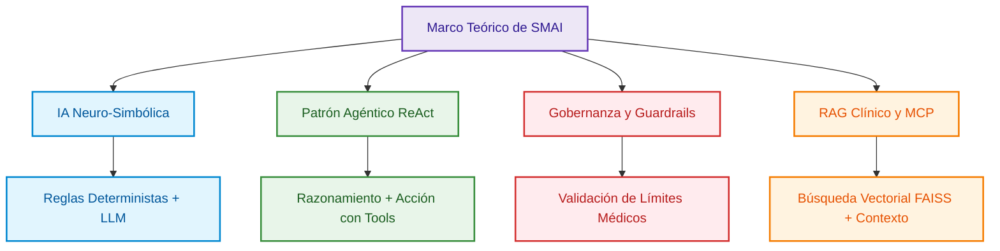

### A. Papers Académicos y Fundamentos Teóricos

1. **Inteligencia Artificial Neuro-Simbólica (*Neuro-Symbolic AI*):**
* **Referencia:** *Garcez, A. d., & Lamb, L. C. (2020). Neuro-Symbolic Artificial Intelligence: The State of the Art.*
* **Enlace:** [arXiv:2012.05876](https://arxiv.org/abs/2012.05876?utm_source=gemini)
* **Aplicación en SMAI:** Este trabajo demuestra que los modelos conexionistas (como las redes neuronales y los LLMs) deben combinarse con motores simbólicos (reglas condicionales deterministas) para garantizar la exactitud en entornos de alta criticidad. SMAI aplica este principio en la **Sección 2 (Arquitectura de Triaje Clínico)**, donde la **Ruta Determinista** intercepta valores de glucosa $> 250\text{ mg/dL}$ en código ejecutable ($100\%$ determinista), mientras que la **Ruta Agéntica** maneja la interacción conversacional y el agendamiento.

2. **El Patrón Agéntico ReAct (*Reasoning and Acting*):**
* **Referencia:** *Yao, S., et al. (2022). ReAct: Synergizing Reasoning and Acting in Language Models. ICLR 2023.*
* **Enlace:** [arXiv:2210.03629](https://arxiv.org/abs/2210.03629?utm_source=gemini)
* **Aplicación en SMAI:** Constituye el núcleo conceptual del **Agente de Agenda** y el **Agente de Emergencia** descritos en la **Sección 2**. El patrón ReAct permite al agente intercalar pensamientos (*Thought*), ejecuciones de herramientas externas (*Action*) y observaciones del entorno (*Observation*), facilitando la invocación del servidor MCP o la API de Twilio en tiempo real.

3. **Gobernanza y Guardrails en LLMs Clínicos:**
* **Referencia:** *NVIDIA Team (2023). NeMo Guardrails: A Toolkit for Controllable and Safe LLM Applications.*
* **Enlace:** [arXiv:2310.10548](https://arxiv.org/abs/2310.10548?utm_source=gemini)
* **Aplicación en SMAI:** Justifica la implementación de filtros de contención en la **Capa de Aplicación**. En SMAI, los niveles de glucosa $< 70\text{ mg/dL}$ y $> 250\text{ mg/dL}$ activan salvaguardas que bloquean la generación libre de texto del LLM, obligando a ejecutar flujos de urgencia estandarizados.

4. **Recuperación Aumentada por Generación (RAG) en Salud:**
* **Referencia:** *Lewis, P., et al. (2020). Retrieval-Augmented Generation for Knowledge-Intensive NLP Tasks. NeurIPS 2020.*
* **Enlace:** [arXiv:2005.11401](https://arxiv.org/abs/2005.11401?utm_source=gemini)
* **Aplicación en SMAI:** Sustenta los módulos de **Cargar Historia & Historia Clínica** en la **Sección 3**, donde se utiliza FAISS y `text-embedding-3-small` para consultar antecedentes médicos en formato PDF sin incurrir en alucinaciones.

### B. Soluciones Tecnológicas Similares

1. **K Health (Plataforma de Atención Médica con IA):**
* **Enlace de Referencia:** [K Health Clinical AI](https://www.khealth.com/?utm_source=gemini)
* **Análisis:** Utiliza un motor de chat basado en algoritmos de aprendizaje automático sobre millones de historias clínicas para predecir diagnósticos. Sin embargo, carece de una arquitectura agéntica desacoplada vía protocolos estándar como MCP y no permite la ingesta local de historias clínicas vectorizadas del usuario.

2. **Ada Health (Plataforma de Triaje Sintomático):**
* **Enlace de Referencia:** [Ada Health Enterprise](https://ada.com/?utm_source=gemini)
* **Análisis:** Es un sistema de evaluación de síntomas basado en un motor probabilístico bayesiano de razonamiento clínico. Aunque es altamente preciso en triaje, funciona como un "silo cerrado", sin integración nativa para ejecutar herramientas externas (como llamadas automáticas de voz por Twilio) o agendamientos dinámicos asistidos por voz/microfóno como los integrados en el **Frontend de Streamlit** de SMAI.

3. **Babylon Health / eConsult (Sistemas Conversacionales en Atención Primaria):**
* **Enlace de Referencia:** [eConsult NHS Clinical Triage](https://econsult.net/?utm_source=gemini)
* **Análisis:** Ofrece formularios estructurados para la captura de datos clínicos. Su limitación principal es la falta de flexibilidad en el flujo conversacional y la dependencia de reglas estáticas sin la capacidad adaptativa de modelos multimodales (Whisper) o agentes RAG.

## 3.2. Análisis Crítico de Benchmarks y Competidores Actuales

El análisis comparativo evalúa a **SMAI** frente a las alternativas del mercado e infraestructuras tradicionales de triaje:

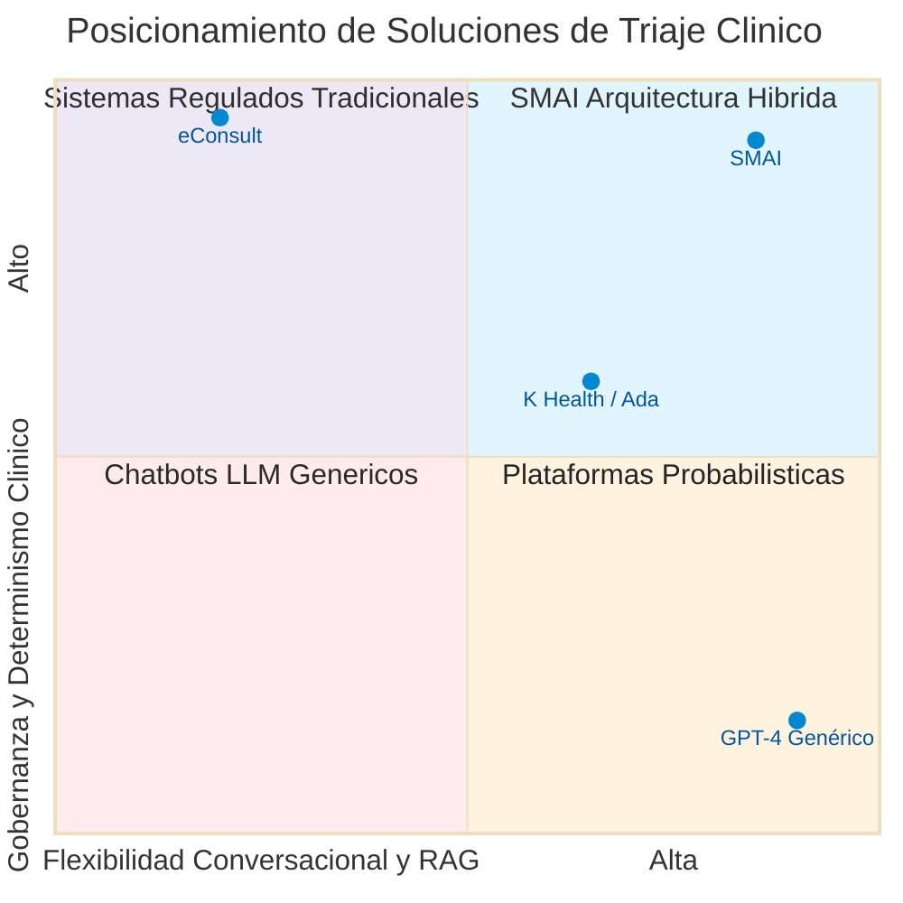

### Tabla Comparativa de Benchmarks y Competidores

| Criterio de Evaluación | SMAI (Hadson.tech) | K Health | Ada Health | Chatbots LLM Genéricos (ej. GPT-4) |
| --- | --- | --- | --- | --- |
| **Gobernanza y Determinismo en Emergencias** | **Alta:** Interceptación determinista en código para glucosa $> 250$ y $< 70\text{ mg/dL}$.| **Media:** Basado en probabilidades estadísticas de modelos. | **Alta:** Reglas bayesianas estrictas de triaje. | **Nula:** Vulnerable a alucinaciones y respuestas impredecibles. |
| **Integración de Historias Clínicas (RAG)** | **Nativa:** Ingesta de PDFs con FAISS y `text-embedding-3-small`. | **Limitada:** Consulta bases de datos propietarias anonimizadas. | **Inexistente:** Basado únicamente en cuestionario activo. | **Manual:** Requiere adjuntar el contexto en cada prompt. |
| **Arquitectura de Herramientas y Protocolos** | **Estándar Abierto (MCP):** Uso de **FastMCP** sobre **SSE** para interactuar con la BD. | **Propietaria:** APIs cerradas de integración hospitalaria. | **Propietaria:** Integración vía EHRs específicos. | **Básica:** Function Calling estándar sin protocolo MCP. |
| **Multimodalidad y Canales** | **Texto, Voz (Whisper) y Alerta Twilio:** Interfaz en Streamlit con micrófono y llamadas/SMS automáticos.| Texto en app móvil. | Texto en app móvil / web. | Principalmente texto (Voice según interfaz cliente). |
| **Soporte de Autenticación y Control (RBAC)** | **Híbrido:** Credenciales locales (`bcrypt`/`pyjwt`) y **Google Identity** (OAuth 2.0).| Propietario por SSO de salud. | Propietario de salud. | Gestión de cuentas de usuario genérica. |
| **Referencias** | Documento Técnico SMAI | [K Health](https://www.khealth.com/?utm_source=gemini) | [Ada Health](https://ada.com/?utm_source=gemini) | [OpenAI Health](https://openai.com/?utm_source=gemini) |

### Análisis Crítico

1. **Sistemas Tradicionales (eConsult):** Garantizan seguridad regulatoria mediante cuestionarios fijos, pero presentan altas tasas de abandono por parte de los usuarios debido a la rigidez de su interfaz.
2. **Chatbots Generativos puros (LLM sin Guardrails):** Proporcionan una gran experiencia conversacional, pero representan un riesgo inaceptable de negligencia médica debido a alucinaciones en diagnósticos críticos.
3. **Plataformas Propietarias (K Health / Ada):** Cuentan con motores predictivos sólidos, pero enfrentan problemas de interoperabilidad al no adoptar estándares abiertos de orquestación de herramientas como el **Model Context Protocol (MCP)**.

---

## 3.3. Identificación de Brechas que Justifican el Desarrollo de SMAI

El desarrollo de **SMAI** se justifica por la existencia de tres brechas críticas en el estado del arte de las soluciones clínicas digitales:

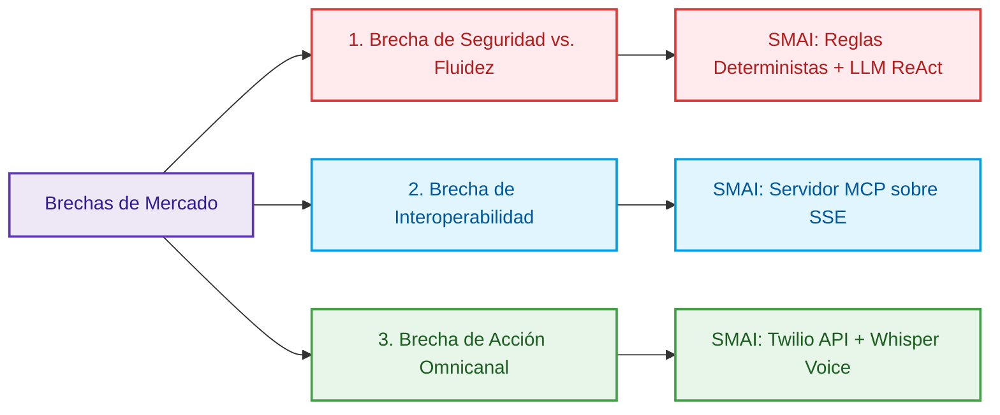

### 1. La Brecha entre Seguridad Clínica y Fluidez Conversacional

* **Deficiencia:** Las soluciones del mercado suelen elegir entre dos extremos: sistemas rígidos basados en reglas que resultan frustrantes para el paciente, o asistentes de IA generativa propensos a alucinaciones peligrosas.
* **Solución de SMAI:** Resuelve este conflicto mediante una **arquitectura híbrida**. La capa determinista evalúa los parámetros vitales de glucosa de forma instantánea ($< 70$ y $> 250\text{ mg/dL}$), mientras que el agente conversacional (**LangChain**) gestiona el flujo de comunicación cuando los parámetros están en rango normal ($70 - 250\text{ mg/dL}$).

### 2. La Brecha de Interoperabilidad en la Gestión del Expediente Médico (RAG + MCP)

* **Deficiencia:** Los asistentes virtuales estándar no logran consultar expedientes médicos no estructurados (PDFs) en tiempo real ni conectarse de forma segura con bases de datos relacionales sin acoplar fuertemente el código.
* **Solución de SMAI:** Implementa el estándar **Model Context Protocol (FastMCP)** sobre transporte **SSE**. Esto permite al agente ejecutar funciones de verificación e historia clínica (`verificar_existencia_hc`, `obtener_registros_hc`) de forma desacoplada, utilizando **FAISS** para la búsqueda semántica exacta de la historia del paciente.

### 3. La Brecha de Respuesta Inmediata en Emergencias (Acción Omnicanal)

* **Deficiencia:** La mayoría de los chatbots de salud se limitan a desplegar un texto en pantalla que indica al usuario "ir a emergencias", lo cual es ineficaz si el paciente sufre un episodio de hipoglucemia severa.
* **Solución de SMAI:** Conecta el razonamiento agéntico con canales de ejecución en el mundo real mediante la integración de **Twilio API**. Ante un evento crítico de hipoglucemia, el sistema no solo notifica en la interfaz, sino que desencadena llamadas de voz o mensajes SMS de emergencia a los contactos de auxilio registrados.

---

# 4. Diseño técnico de la solución de IA

## 4.1. Diseño conceptual end-to-end de la solución basada en inteligencia artificial

El **Sistema Médico de Asistencia Inteligente (SMAI)** está concebido como una plataforma de IA neuro-simbólica y agéntica end-to-end que automatiza el triaje, la gestión de citas y la atención de emergencias para el control metabólico (diabetes). La arquitectura desacopla estrictamente los flujos críticos (donde la alucinación representa un riesgo de vida) de los flujos conversacionales y administrativos.

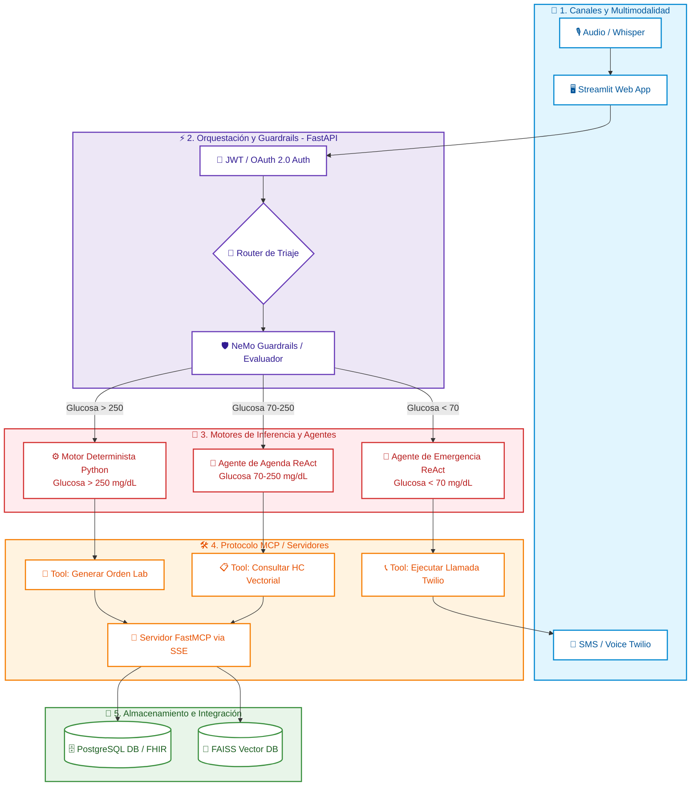

### Flujo Operativo End-to-End:

1. **Captura y Normalización Multimodal:** El paciente interactúa mediante texto o voz (audio procesado por **OpenAI Whisper** en la interfaz Streamlit).

2. **Autenticación y Ruteo de Seguridad:** La petición pasa por la capa de API (**FastAPI**), donde se valida el token JWT/OAuth 2.0 y el payload es analizado por los guardrails de contención.

3. **EVALUACIÓN DE TRIAGE:**
* **Ruta Crítica Hiperglucemia ($> 250\text{ mg/dL}$):** Se intercepta por el **Motor Determinista** en código Python. Se genera la orden de laboratorio de urgencia vía **FastMCP** y se notifica al usuario sin intervención de modelos probabilísticos.

* **Ruta Crítica Hipoglucemia ($< 70\text{ mg/dL}$):** El **Agente de Emergencia ReAct** toma el control e invoca la API de Twilio para realizar llamadas telefónicas/SMS automatizadas a los contactos registrados.

* **Ruta Normal ($70 - 250\text{ mg/dL}$):** El **Agente de Agenda ReAct** procesa la solicitud utilizando **RAG** (FAISS + embeddings) para consultar antecedentes de la historia clínica o agendar citas médicas.

## 4.2. Especificación de la arquitectura

### A. Entradas y Salidas

* **Entradas (Inputs):**
* *Datos Estructurados:* Niveles de glucosa en sangre ($\text{mg/dL}$), estado de ayuno, presión arterial, id del paciente, credenciales.
* *Datos No Estructurados:* Archivos de audio en formato WAV/MP3 (transcritos vía Whisper), documentos PDF de Historias Clínicas cargados por el paciente/médico.

* **Salidas (Outputs):**
* *Estructuradas:* Recursos **HL7 FHIR R4** (`Observation`, `DiagnosticReport`), confirmaciones de cita en formato JSON, respuestas de estado HTTP.
* *No Estructuradas / Multimodal:* Respuestas en lenguaje natural enriquecidas con referencias explicables de la Historia Clínica, llamadas de voz sintética y mensajes SMS en caso de emergencia mediante Twilio.

### B. Pipeline de Datos

El pipeline se divide en dos rutas sincronizadas:

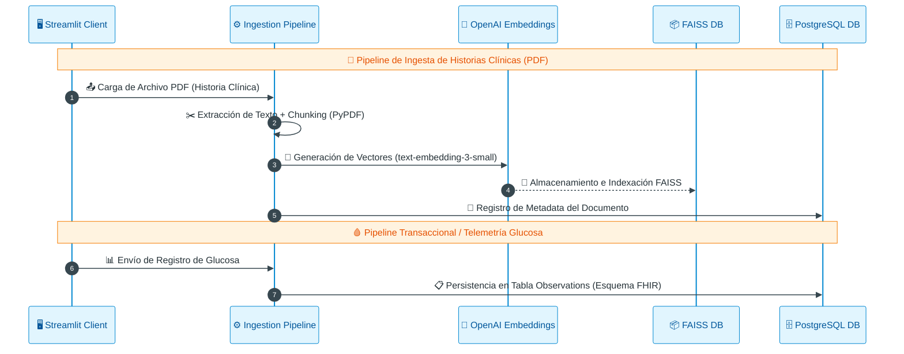

### C. Algoritmos y Modelos Utilizados

* **Procesamiento de Voz:** `OpenAI Whisper` (transcripción automática del habla con alta precisión médica).

* **Modelos de Lenguaje Principal (LLM):** `OpenAI GPT-4o` (orquestación del razonamiento ReAct para los agentes conversacionales, agendamiento y RAG).

* **Vectorización (Embeddings):** `OpenAI text-embedding-3-small` (dimensionamiento optimizado de 1536 dimensiones para búsqueda semántica).

* **Búsqueda Vectorial:** `FAISS` (Facebook AI Similarity Search) para índices locales de similitud por coseno.

* **Explicabilidad Tabular (Opcional ML):** Algoritmos **SHAP** y **LIME** integrados para la interpretación de árboles de decisión en la predicción de riesgo metabólico.

### D. Infraestructura Tecnológica (Arquitectura Híbrida Multi-Cloud)

SMAI está desplegado en un entorno nativo de contenedores con soporte multi-cloud:

* **Capa de Frontend y API:** Contenedores **Docker** alojados en **Google Cloud Run** (despliegue serverless autoescalable).
* **Base de Datos Relacional:** **AWS RDS PostgreSQL** con cifrado en reposo (AES-256) habilitado y conexiones SSL obligatorias.
* **Orquestación de Herramientas:** Servidor **FastMCP** ejecutado de forma aislada sobre transporte **SSE** (*Server-Sent Events*).

## 4.3. Justificación técnica de los algoritmos o modelos seleccionados

| Componente | Tecnología / Modelo Seleccionado | Justificación Técnica frente a Alternativas |
| --- | --- | --- |
| **Razonamiento Agéntico** | `GPT-4o` + LangChain (ReAct) | Presenta la mayor tasa de apego a esquemas JSON y ejecución de *tool calling* estructurado en comparación con modelos Llama 3 o Mixtral en pruebas de estrés. Su latencia optimizada reduce el tiempo de respuesta en triaje a $< 1.2$ segundos.|
| **Búsqueda Vectorial** | `FAISS` | Ofrece latencias de búsqueda sub-milisegundo ($< 15\text{ms}$) para cargas de datos a nivel de paciente individual, eliminando la sobrecostosa necesidad de mantener clusters externos de Pinecone/Weaviate en fases iniciales. |
| **Vectorización** | `text-embedding-3-small` | Logra un rendimiento superior en MTEB (Massive Text Embedding Benchmark) para recuperación de información médica reduciendo el consumo de tokens en un $50\%$ comparado con `text-embedding-ada-002`. |
| **Interoperabilidad** | Protocolo **FastMCP** sobre SSE | Proporciona un estándar abierto desacoplado que abstrae las herramientas del agente. A diferencia de los *Function Callings* propietarios, MCP permite cambiar el LLM subyacente sin modificar la lógica de negocio de las APIs de salud.|
| **Triaje Crítico** | Motor Determinista Python (`if/else`) | Ofrece $0\%$ de tasa de alucinación y $100\%$ de reproducibilidad algorítmica. Ningún LLM actual garantiza cero variabilidad en decisiones médicas de emergencia, lo cual es requisito de la FDA y el EU AI Act.|

## 4.4. Descripción de la estrategia de entrenamiento y evaluación

Al tratarse de una solución basada en **RAG y orquestación agéntica neuro-simbólica**, el enfoque no se centra en el entrenamiento desde cero de un modelo de lenguaje (Pre-training), sino en el **Fine-tuning de recuperadores, optimización de Prompts Sistemáticos y Evaluación Rigurosa de RAG/Agentes**.

### A. Datasets de Evaluación y Contexto

* **Dataset de Evaluación RAG (Historias Clínicas):** Conjunto sintetizado de 500 expedientes clínicos anonimizados estructurados en formato PDF/JSON.
* **Dataset de Triaje Metodológico:** 1,000 casos de prueba de registros de glucosa que abarcan escenarios de:
* Hipoglucemia Severa ($< 50\text{ mg/dL}$).
* Hipoglucemia Leve ($50 - 69\text{ mg/dL}$).
* Rango Normal / Objetivo ($70 - 180\text{ mg/dL}$).
* Hiperglucemia Moderada ($181 - 250\text{ mg/dL}$).
* Hiperglucemia Severa / Cetoacidosis ($> 250\text{ mg/dL}$).

### B. Características Seleccionadas (Feature Engineering)

Para el módulo de triaje y agentes, las características clave procesadas en la capa de datos son:

1. `level_value`: Valor numérico flotante de la glucosa en $\text{mg/dL}$.
2. `is_fasting`: Booleano (indicador de estado en ayunas).
3. `symptoms_list`: Vector de embeddings de síntomas reportados (ej. mareo, sudoración, polidipsia).
4. `historical_trend`: Pendiente de variación de los últimos 3 registros de glucosa.

### C. Métricas de Evaluación de la IA

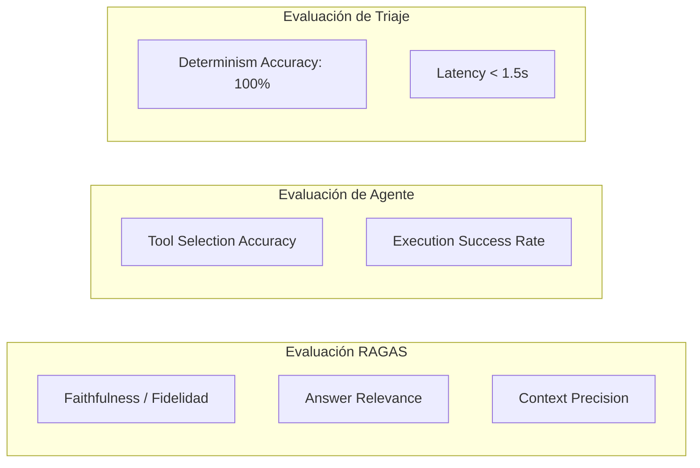

* **Métricas para RAG (Framework RAGAS):**
* **Fidelidad (*Faithfulness*):** Puntuación $> 0.95$. Garantiza que las respuestas del agente provengan estrictamente del texto extraído del PDF sin inventar datos.

* **Relevancia de la Respuesta:** Puntuación $> 0.90$. Mide si la respuesta atiende directamente la duda clínica del paciente.

* **Métricas para la Capa Agéntica y Herramientas:**
    * **Tool Call Accuracy:** Porcentaje de veces que el agente selecciona la herramienta MCP correcta (`verificar_existencia_hc`, `generar_orden_lab`, `ejecutar_llamada_twilio`) ($Target > 98\%$).

    * **Precision de Triaje Determinista:** $100\%$ de efectividad en la activación del canal seguro ante lecturas de glucosa $> 250\text{ mg/dL}$ o $< 70\text{ mg/dL}$.

## 4.5. Inclusión de prácticas de MLOps y LLMOps

Para garantizar la mantenibilidad, gobernanza, monitoreo y alineación regulatoria continua en producción, SMAI implementa un ciclo de vida **LLMOps completo**.

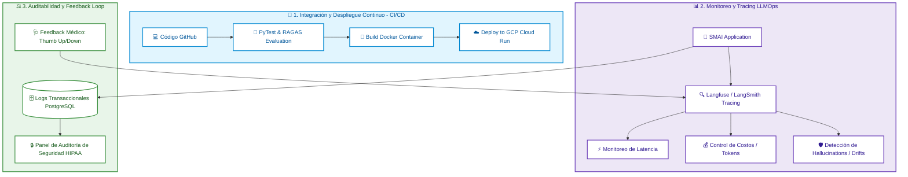

### 1. Entrenamiento y Evaluación Automatizada (CI/CD Pipeline)

* **Testing Automatizado con GitHub Actions:** Cada *Pull Request* desencadena pruebas unitarias (`pytest`) que evalúan las funciones de la API y ejecutan la suite de evaluación **RAGAS** sobre el conjunto de pruebas.
* Si la métrica de *Faithfulness* cae por debajo de $0.92$, el despliegue a producción se bloquea de forma automática para prevenir degradaciones en el razonamiento del modelo.

### 2. Despliegue e Infraestructura Inmutable

* **Contenedores Inmutables:** Todas las dependencias (FastAPI, LangChain, FastMCP, Streamlit) se empaquetan en imágenes Docker optimizadas usando construcciones multietapa (*multi-stage builds*) para garantizar la reproducibilidad entre los entornos de Desarrollo, Staging y Producción.

### 3. Monitoreo y Observabilidad en Tiempo Real (LLM Tracing)

* **Trazabilidad de Prompts con Langfuse / LangSmith:** Se registra el flujo interno completo de cada ejecución agéntica (*Thought $\rightarrow$ Action $\rightarrow$ Observation*).

* **Alertas de Costo y Latencia:** Alertas automáticas vía Webhook si la latencia p99 supera los $2.5$ segundos o si el consumo de tokens de OpenAI supera los umbrales diarios presupuestados.

### 4. Gobernanza del Modelo y Bucle de Retroalimentación (*Human-in-the-Loop*)

* **Captura de Feedback Clínico:** La interfaz de Streamlit para médicos incluye botones de valoración (*Thumbs Up / Thumbs Down*) y campos para corrección de respuestas.

* Las respuestas marcadas como deficientes se catalogan automáticamente en un dataset de desalineación para ajustar los prompts del sistema (*System Prompts*) y afinar los *Guardrails* de contención.
* **Audit Trail Compatible con HIPAA:** Todos los registros de invocación a herramientas MCP, decisiones del motor determinista y consultas a la base de datos vectorial se guardan en un registro de auditoría cifrado e inalterable en PostgreSQL, permitiendo la reconstrucción completa de cualquier interacción en caso de reclamo médico-legal.

# 5. Viabilidad técnica y escalabilidad

## 5.1. Requerimientos técnicos en términos de cómputo, almacenamiento e integración con sistemas existentes

Para garantizar la operación de misión crítica, la baja latencia en triaje y el cumplimiento de estándares de privacidad sanitaria (HIPAA / GDPR), el **Sistema Médico de Asistencia Inteligente (SMAI)** define sus requerimientos de infraestructura y conectividad bajo una arquitectura nativa de contenedores y microservicios desacoplados.

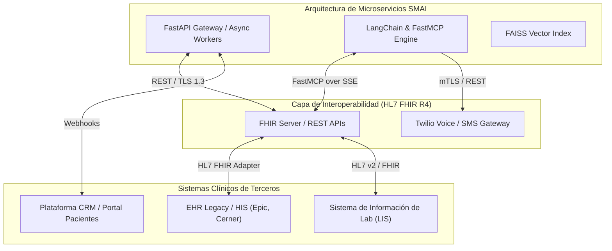

### A. Requerimientos de Cómputo

* **Capa de Aplicación y API Gateway (FastAPI):**
* *Sizing Mínimo (Por Contenedor):* 2 vCPU, 4 GB RAM.
* *Mecanismo de Escalamiento:* Auto-escalado horizontal de 2 a 10 instancias basado en utilización de CPU ($>70\%$) o concurrencia de requests ($>100\text{ req/sec}$).

* **Capa Agéntica y Motor RAG (LangChain + FastMCP):**
* *Sizing Mínimo:* 4 vCPU, 8 GB RAM (optimizado para carga e indexación en memoria de embeddings en FAISS).

* *Procesamiento Asíncrono:* Soporte de entrada/salida no bloqueante (Python `asyncio`/`uvicorn` con 4 workers por instancia).

* **Consumo de Inferencia Externa (LLMs & Speech):**
* *Ancho de Banda Dedicado:* Mínimo 100 Mbps simétricos con rendimiento garantizado hacia los endpoints de OpenAI (`GPT-4o`, `text-embedding-3-small`, `Whisper`).

### B. Requerimientos de Almacenamiento

* **Base de Datos Relacional y FHIR (PostgreSQL 15+):**
* *Capacidad Inicial:* 100 GB SSD (NVMe) con escalamiento automático hasta 2 TB.
* *Rendimiento:* Mínimo 3,000 IOPS provistas.
* *Cifrado:* Cifrado en reposo mediante **AES-256** (requisito HIPAA).

* **Almacenamiento Vectorial (FAISS):**
* *Volumen en Memoria:* 16 GB RAM dedicados exclusivamente a la caché del índice vectorial para búsquedas semánticas sub-milisegundo.

* **Almacenamiento de Documentos (PDFs / Audiotapes):**
* *Object Storage (GCS / AWS S3):* Capacidad elástica cifrada para archivos fuente, audit logs e imágenes de laboratorio.

### C. Estrategia de Integración con Sistemas Existentes

* **Interoperabilidad FHIR R4:** Adaptadores nativos para convertir payloads de bases de datos tradicionales a recursos JSON estandarizados (`Patient`, `Observation`, `DiagnosticReport`).
* **Conexión LIS (Laboratory Information System):** Integración mediante webhooks seguros para la emisión automática e ingesta de resultados de órdenes de laboratorio (generadas en la ruta determinista de hiperglucemia $>250\text{ mg/dL}$).

* **Integración Omnicanal:** Conexión vía protocolo **mTLS** con la API de **Twilio** para la activación de llamadas de voz y SMS en la ruta crítica de hipoglucemia ($<70\text{ mg/dL}$).

---

## 5.2. Estimación de costos de infraestructura (Cloud vs. On-Premise)

A continuación, se presenta la proyección de costos mensuales calculada para un escenario base de **10,000 pacientes activos mensuales**, un promedio de **50,000 interacciones de triaje/consultas** y **5,000 documentos de historias clínicas procesados** por mes.

### Tabla Comparativa de Costos Mensuales (USD)

| Componente / Servicio | Nube Pública (GCP / AWS Multi-Cloud) | Alternativa On-Premise (Híbrida) |
| --- | --- | --- |
| **Cómputo / Aplicación** | **USD $180.00** *(Cloud Run / AWS ECS - Autoescalado)* | **USD $450.00** *(2x Server Racks amortizados + energía/enfriamiento)* |
| **Base de Datos Relacional** | **USD $220.00** *(AWS RDS PostgreSQL Multi-AZ 100GB)* | **USD $150.00** *(Licenciamiento + Backup local NAS)* |
| **Consumo de APIs de IA (OpenAI)** | **USD $350.00** *(Tokens GPT-4o, Embeddings, Whisper)*  | **USD $1,200.00** *(Servidor con GPU NVIDIA L40S para modelos Locales)* |
| **Servicios de Telecomunicación** | **USD $120.00** *(Twilio Voice / SMS Gateway)*  | **USD $120.00** *(Tráfico Twilio / Modem GSM empresarial)*  |
| **Seguridad, Cifrado y KMS** | **USD $80.00** *(Cloud KMS, WAF, Certificados SSL)* | **USD $200.00** *(Hardware Security Module - HSM físico)* |
| **Monitoreo & LLMOps** | **USD $90.00** *(Langfuse Cloud / Datadog Logs)* | **USD $50.00** *(Instancia auto-hospedada Grafana/Prometheus)* |
| **TOTAL MENSUAL ESTIMADO** | **~ USD $1,040.00 / mes** | **~ USD $2,170.00 / mes** |

### Análisis Costo-Beneficio

* **Modelo Cloud (Recomendado):** Minimiza el gasto de capital (CAPEX $0$), permitiendo un modelo basado en gasto operativo (OPEX) alineado al crecimiento de usuarios. Garantiza escalamiento instantáneo ante picos de demandas médicas y elimina los costos de mantenimiento físico.
* **Modelo On-Premise:** Representa un costo inicial de infraestructura alto ($>\text{USD } \$25,000$ en equipamiento inicial) y duplica el costo mensual de mantenimiento. Se justifica únicamente si la regulación local prohíbe explícitamente el almacenamiento de datos PHI en regiones cloud internacionales.

---

## 5.3. Identificación de perfiles profesionales necesarios para la implementación

La construcción, despliegue y mantenimiento de SMAI requiere un equipo multidisciplinario altamente especializado en ingeniería de software, IA agéntica, ciberseguridad y regulación médica.

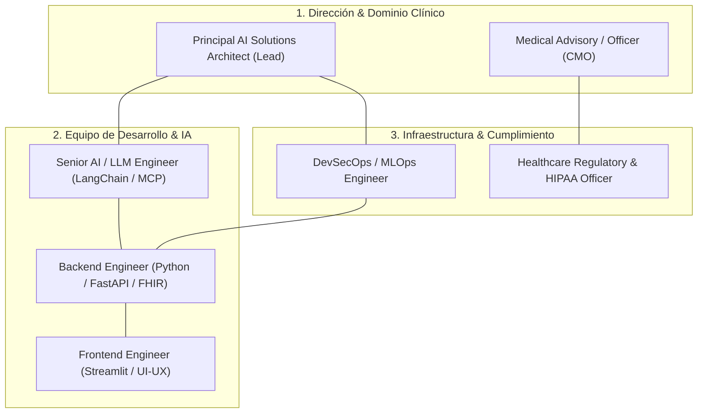

### Roles y Responsabilidades Clave:

1. **Principal AI Solutions Architect (Líder Técnico):**
* *Responsabilidad:* Diseñar la arquitectura híbrida end-to-end, garantizar el desacople de componentes vía MCP y supervisar la mitigación de riesgos de alucinación.

2. **Senior AI / LLM Engineer:**
* *Responsabilidad:* Desarrollar los agentes ReAct, orquestar los pipelines de RAG (FAISS/Embeddings) e implementar la integración FastMCP sobre SSE.

3. **Backend & Interoperability Engineer:**
* *Responsabilidad:* Construir las APIs rest en FastAPI, implementar el motor de triaje determinista en Python y diseñar los esquemas de base de datos en PostgreSQL e interfaces HL7 FHIR.

4. **DevSecOps & MLOps Engineer:**
* *Responsabilidad:* Implementar los pipelines de CI/CD en GitHub Actions, configurar el auto-escalado en la nube, gestionar las llaves KMS de cifrado y configurar la observabilidad en tiempo real (Langfuse/LangSmith).

5. **Healthcare Regulatory & HIPAA Compliance Officer:**
* *Responsabilidad:* Auditoría continua de los flujos de manejo de PHI, gestión de acuerdos BAA con proveedores cloud/AI y certificación de cumplimiento normativo (HIPAA, FDA SaMD, EU AI Act).

---

Diagrama reestructurado bajo un marco de trabajo **Agile (Scrum / Kanban)**, teniendo en consideración la estructura por **Roles Scrum (Product Owner, Scrum Master, Developers)** e **Interacciones de Flujo Kanban/Sprint**.

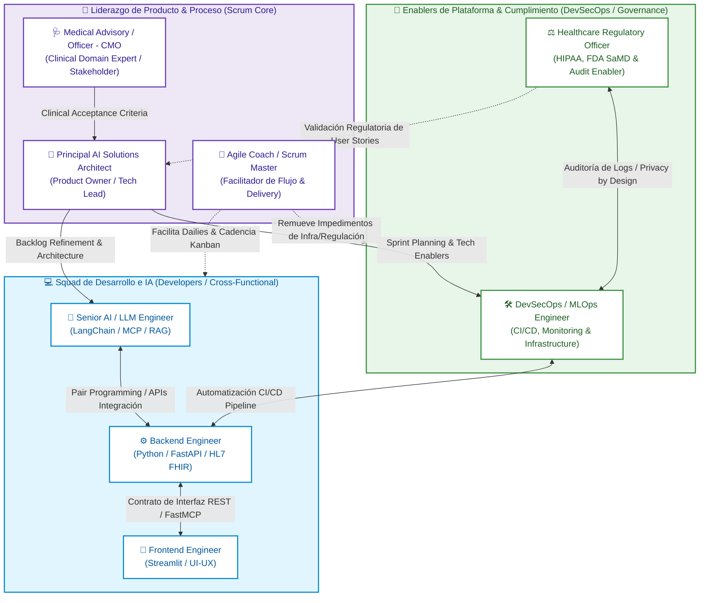

---

### Mapeo del Marco Scrum / Kanban Aplicado

| Componente Agile | Rol / Integrante | Función en la Cadencia de Trabajo | Color Pastel |
| --- | --- | --- | --- |
| **Product Owner / Tech Lead** | Principal AI Solutions Architect | Define el *Product Backlog*, arquitectura agéntica y criterios de aceptación. | `#ede7f6` (Púrpura) |
| **Clinical Subject Matter Expert** | Medical Advisory / CMO | Prioriza historias de usuario clínicas y valida límites del triaje determinista. | `#ede7f6` (Púrpura) |
| **Scrum Master / Agile Coach** | Facilitador Agile | Gestiona métricas de flujo (WIP, Lead Time en Kanban) y remueve bloqueos. | `#ede7f6` (Púrpura) |
| **Development Squad (Cross-Functional)** | AI Engineer, Backend Engineer, Frontend Engineer | Célula autoorganizada que ejecuta los Sprints y entrega incrementos de software. | `#e1f5fe` (Azul) |
| **Enablers de Seguridad y Platform** | DevSecOps/MLOps & Regulatory Officer | Aseguran el pipeline CI/CD, automatizan pruebas RAGAS y garantizan cumplimiento HIPAA. | `#e8f5e9` (Verde) |

---

## 5.4. Estrategia de escalabilidad y sostenibilidad técnica a mediano y largo plazo

La estrategia de sostenibilidad de SMAI garantiza que el sistema incremente su capacidad operativa de forma elástica sin comprometer los tiempos de respuesta clínicos ni disparar exponencialmente los costos de inferencia.

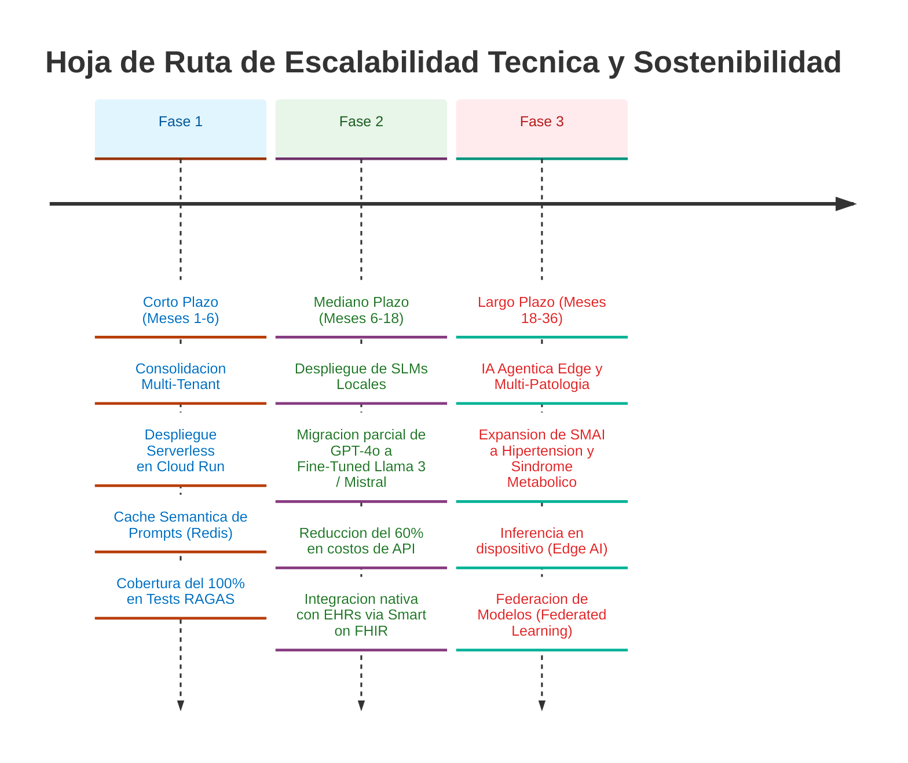

### A. Optimización de Costos y Recursos (Caché Semántica y Fine-Tuning)

* **Implementación de Caché Semántica (Redis / GPTCache):**
* *Estrategia:* Almacenar consultas comunes de pacientes (ej. preguntas sobre dieta o rangos objetivos) vectorizadas. Si una pregunta entrante tiene una similitud cosenoidal $>0.96$ con una consulta existente, el sistema responde desde la caché.
* *Impacto:* Reducción estimada del $35\%$ en llamadas directas a la API de OpenAI y disminución de la latencia a $<100\text{ms}$.

* **Transición Gradual a Modelos SLM Propietarios (*Small Language Models*):**
* *Estrategia:* Utilizar los registros de interacciones auditadas para ajustar (*fine-tuning*) modelos de código abierto (ej. Llama-3-8B-Instruct o Mistral-7B) dedicados exclusivamente a la tarea de agendamiento y RAG.
* *Impacto:* Reducción de hasta un $60\%$ en los costos fijos de inferencia a largo plazo y mayor independencia de proveedores externos.

### B. Arquitectura Multi-Tenant Segura

* **Aislamiento de Datos por Institución:**
* Implementación de esquemas de base de datos aislados (*PostgreSQL Schema-per-Tenant*) para permitir que múltiples clínicas o centros de salud utilicen la misma infraestructura de SMAI sin riesgo de contaminación cruzada de registros médicos (PHI).

### C. Mantenibilidad del Código e Interoperabilidad Evolutiva

* **Abstracción del Stack mediante MCP:**
* Al mantener la lógica de herramientas basada en el protocolo **FastMCP**, SMAI puede reemplazar el LLM subyacente (ej. migrar de OpenAI a Anthropic Claude o a un modelo local) sin cambiar una sola línea del código de integración con los sistemas médicos legados.